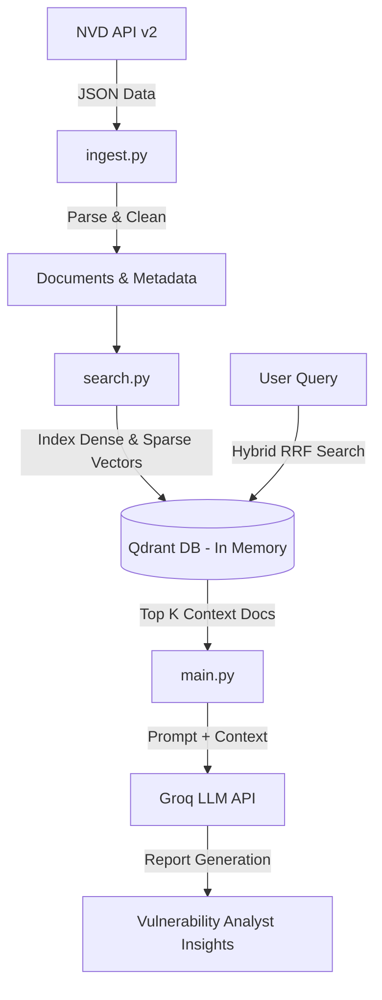

# CVE Intelligence (CVE-Intel) — Hybrid RAG Search & Analysis

A powerful, production-ready Hybrid RAG (Retrieval-Augmented Generation) pipeline designed to ingest, index, search, and analyze security vulnerabilities (CVEs) from the National Vulnerability Database (NVD).

The project leverages a **Hybrid Search** approach combining **Dense (Semantic) Retrieval** and **Sparse (Keyword/BM25) Retrieval** with **RRF (Reciprocal Rank Fusion)** scoring, and integrates with **Groq LLM** to generate structured vulnerability reports and insights.

---

## Key Features

* **Data Ingestion**: Directly fetches recent vulnerability data from the official [NVD API v2](https://services.nvd.nist.gov/rest/json/cves/2.0) and parses essential fields (CVE ID, base score, severity, published date, descriptions).
* **Hybrid Retrieval (Dense + Sparse)**:
  * **Dense Embedding**: Employs `sentence-transformers/all-MiniLM-L6-v2` for semantic context retrieval.
  * **Sparse Embedding**: Employs `Qdrant/bm25` (BM25) for precise keyword matching (e.g. searching specific CVE IDs or exact terms).
  * **RRF Fusion**: Fuses results using Reciprocal Rank Fusion (RRF) for optimal ranking accuracy.
* **Vector Database**: Built on [Qdrant](https://qdrant.tech/) (running in-memory for zero-setup execution).
* **Metadata Filtering**: Supports real-time server-side filtering of results by vulnerability severity level (`CRITICAL`, `HIGH`, `MEDIUM`, etc.).
* **Vulnerability Reports**: Integrated with Groq's LLM (`llama-3.3-70b-versatile`) to generate grounded, context-aware analysis of fetched vulnerabilities.

---

## Architecture Overview



---

## Setup & Installation

### 1. Clone the Repository
```bash
git clone https://github.com/Abhinand-PV/Hybrid-RAG.git
cd cve-intel
```

### 2. Install Dependencies
Ensure you have Python 3.9+ installed, then run:
```bash
pip install -r requirements.txt
```

### 3. Environment Configuration
Duplicate the provided example env file and add your Groq API key:
```bash
copy .env.example .env
```
Open `.env` and configure your credentials:
```env
GROQ_API_KEY=your_actual_groq_api_key_here
```

---

## Usage

### 1. Run the Full Pipeline
Executes data fetching, in-memory database creation, hybrid query comparisons, and generates a vulnerability report using Groq:
```bash
python main.py
```

### 2. Test Ingestion Separately
Fetch recent CVEs and verify that they parse correctly:
```bash
python ingest.py
```

### 3. Test Metadata Filters
Run a structured test showcasing how the hybrid search handles query matching combined with severity-level filters:
```bash
python test_filter.py
```

---

## Configuration File (`config.py`)

You can easily adjust the models, collection names, and parameters inside [config.py](file:///c:/Users/Lenovo/Desktop/cve-intel/config.py):
* `GROQ_API_KEY`: Fetches the key from the environment variables.
* `GROQ_MODEL`: Default LLM (`llama-3.3-70b-versatile`).
* `DENSE_MODEL`: The transformer model used for semantic search.
* `SPARSE_MODEL`: The BM25 model configuration.
