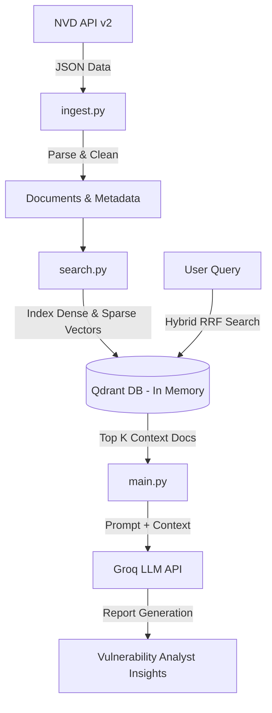

# CVE Intelligence (CVE-Intel) — Hybrid RAG Search & Analysis

[](https://www.python.org/)
[](https://qdrant.tech/)
[](https://groq.com/)

A powerful, production-ready Hybrid RAG (Retrieval-Augmented Generation) pipeline designed to ingest, index, search, and analyze security vulnerabilities (CVEs) from the National Vulnerability Database (NVD).

The project leverages a **Hybrid Search** approach combining **Dense (Semantic) Retrieval** and **Sparse (Keyword/BM25) Retrieval** with **RRF (Reciprocal Rank Fusion)** scoring, and integrates with **Groq LLM** to generate structured vulnerability reports and insights.

---

## 🏗️ Architecture Overview



---

## ✨ Key Features

*   **Data Ingestion**: Directly fetches recent vulnerability data from the official [NVD API v2](https://services.nvd.nist.gov/rest/json/cves/2.0) and parses essential fields (CVE ID, base score, severity, published date, descriptions).
*   **Hybrid Retrieval (Dense + Sparse)**:
    *   **Dense Embedding**: Employs `sentence-transformers/all-MiniLM-L6-v2` for semantic context retrieval.
    *   **Sparse Embedding**: Employs `Qdrant/bm25` (BM25) for precise keyword matching (e.g. searching specific CVE IDs or exact terms).
    *   **RRF Fusion**: Fuses results using Reciprocal Rank Fusion (RRF) for optimal ranking accuracy.
*   **Vector Database**: Built on [Qdrant](https://qdrant.tech/) (running in-memory for zero-setup execution).
*   **Metadata & Score Filtering**: Supports real-time server-side filtering of results by vulnerability severity level (`CRITICAL`, `HIGH`, `MEDIUM`, etc.), minimum CVSS scores (e.g. `>= 7.0`), and custom score thresholds.
*   **Vulnerability Reports**: Integrated with Groq's LLM (`llama-3.3-70b-versatile`) to generate grounded, context-aware analysis of fetched vulnerabilities.

---

## 🚀 Setup & Installation

### 1. Clone the Repository
```bash
git clone https://github.com/Abhinand-PV/Hybrid-RAG.git
cd cve-intel
```

### 2. Install Dependencies
Ensure you have Python 3.9+ installed, then run:
```bash
pip install -r requirements.txt
```

### 3. Environment Configuration
Duplicate the provided example env file and add your Groq API key:
```bash
copy .env.example .env
```
Open `.env` and configure your credentials:
```env
GROQ_API_KEY=your_actual_groq_api_key_here
```

---

## 💻 How to Use

This project offers both pre-built scripts for analysis/testing and a modular API that you can import into your own Python applications.

### 1. Pre-built Executable Scripts

#### Run the Interactive CLI (Recommended)
Launch the beautiful interactive terminal application to perform search comparisons, severity filtering, cache management, and Groq LLM reporting:
```bash
python cli.py
```

#### Run the Full RAG Pipeline
Executes NVD data fetching, database creation, hybrid query comparisons, and generates a vulnerability report using Groq.
```bash
python main.py
```
*   **What it does:**
    1. Spins up Qdrant using persistent local storage (`./qdrant_db`).
    2. Checks if local storage has data; if not, fetches the latest 50 CVEs from the NVD API (utilizing local `cve_cache.json` caching).
    3. Indexes documents using Dense and Sparse vectors.
    4. Compares search results across Dense-only, Sparse-only, and Hybrid (RRF) strategies.
    5. Sends the filtered critical context to Groq to generate a final summary report.

#### Test Ingestion Separately
Fetch recent CVEs and verify that they parse correctly:
```bash
python ingest.py
```
*   **Expected Output Example:**
    ```text
    Fetching CVEs from NVD API...
    Parsed 50 CVE documents.

    Sample document:
    CVE-2024-21732: FlyCms through abbaa5a allows XSS via the permission management feature. (Severity: MEDIUM, CVSS: 6.1)
    Metadata: {'cve_id': 'CVE-2024-21732', 'severity': 'MEDIUM', ...}
    ```

#### Test Metadata Filters
Run a structured test showcasing how the hybrid search handles query matching combined with severity-level filters:
```bash
python test_filter.py
```
*   **Expected Output Example:**
    ```text
    Ingested 50 documents into 'cve-intel'.
    Hybrid search WITHOUT severity filter:
      CVE-2023-33032 - Severity: CRITICAL
      CVE-2023-33038 - Severity: MEDIUM
      ...
    
    Hybrid search WITH severity_filter='CRITICAL':
      CVE-2023-33032 - Severity: CRITICAL
      CVE-2023-33030 - Severity: CRITICAL
      ...
    ```

---

### 2. Programmatic Usage (API Integration)

You can import and use the pipeline components in your own Python projects. Here is a simple example showing how to initialize Qdrant, ingest CVEs, and search using hybrid search with severity metadata filters:

```python
from qdrant_client import QdrantClient
from ingest import fetch_cves, parse_cve_records
from search import create_collection, ingest_documents, hybrid_search

# 1. Initialize Qdrant Client (either in-memory or a remote instance)
client = QdrantClient(":memory:")

# 2. Fetch and parse CVE data
raw_cves = fetch_cves(results_per_page=10)
documents = parse_cve_records(raw_cves)

# 3. Setup the collection and ingest documents
create_collection(client)
ingest_documents(client, documents)

# 4. Perform Hybrid Search with RRF Fusion, Severity Filter, Min CVSS, and Score Threshold
query = "remote code execution"
results = hybrid_search(client, query, limit=3, severity_filter="CRITICAL", min_cvss=7.0, score_threshold=0.01)

# 5. Process search results
for score_point in results:
    payload = score_point.payload
    print(f"[{score_point.score:.3f}] {payload['cve_id']} | Severity: {payload['severity']} | CVSS: {payload['cvss_score']}")
    print(f"Description: {payload['description']}\n")
```

---

## ⚙️ Configuration (`config.py`)

You can adjust the models, collection names, and parameters inside [config.py](file:///c:/Users/Lenovo/Desktop/cve-intel/config.py):
*   `GROQ_API_KEY`: Fetches the API key from environment variables.
*   `GROQ_MODEL`: Default LLM (`llama-3.3-70b-versatile`).
*   `COLLECTION_NAME`: Qdrant collection name (`cve-intel`).
*   `DENSE_MODEL`: The transformer model used for semantic search (`sentence-transformers/all-MiniLM-L6-v2`).
*   `SPARSE_MODEL`: The BM25 model configuration (`Qdrant/bm25`).
*   `NVD_API_URL`: Base URL for NVD CVE v2 API.
*   `CVE_CACHE_FILE`: Name of the JSON cache file for raw NVD API data (`cve_cache.json`).
*   `CACHE_EXPIRY_HOURS`: Cache expiration time in hours (`24`).
*   `QDRANT_PATH`: Local storage folder path for Qdrant persistence (`./qdrant_db`).
