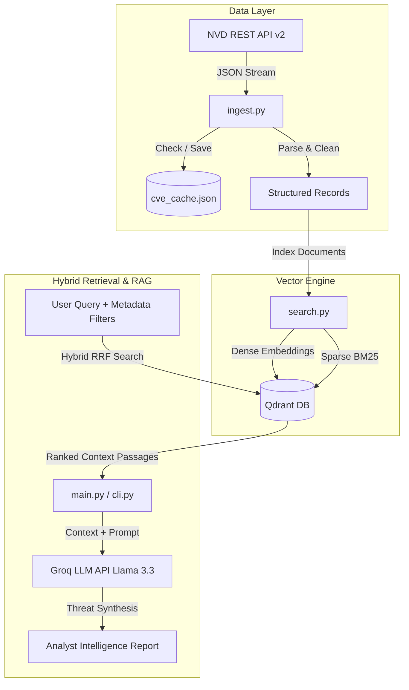

# 🛡️ CVE Intelligence (CVE-Intel) — Hybrid RAG Search & Threat Analysis Engine

[](https://www.python.org/)
[](https://qdrant.tech/)
[](https://github.com/qdrant/fastembed)
[](https://groq.com/)
[](LICENSE)
[](https://github.com/Abhinand-PV/Hybrid-RAG/pulls)

> **CVE-Intel** is a production-grade, enterprise-ready **Hybrid Retrieval-Augmented Generation (RAG)** pipeline and vulnerability analysis engine. It ingests official National Vulnerability Database ([NVD API v2](https://services.nvd.nist.gov/rest/json/cves/2.0)) records, indexes them with dual dense and sparse embeddings inside [Qdrant](https://qdrant.tech/), and fuses results using **Reciprocal Rank Fusion (RRF)** for high-precision security intelligence and LLM synthesis.

---

## 📑 Table of Contents

- [Why Hybrid RAG for CVEs?](#-why-hybrid-rag-for-cves)
- [✨ Key Features](#-key-features)
- [🏗️ System Architecture](#️-system-architecture)
- [📂 Directory Structure](#-directory-structure)
- [🚀 Quick Start & Installation](#-quick-start--installation)
- [💻 Usage Modes](#-usage-modes)
  - [1. Interactive Terminal CLI (Recommended)](#1-interactive-terminal-cli-recommended)
  - [2. Automated RAG Pipeline](#2-automated-rag-pipeline)
  - [3. Standalone Data Ingestion](#3-standalone-data-ingestion)
  - [4. Metadata Filter Benchmarking](#4-metadata-filter-benchmarking)
- [🐍 Programmatic API Reference](#-programmatic-api-reference)
- [⚙️ Configuration Matrix](#️-configuration-matrix)
- [📊 Retrieval Benchmarks: Dense vs. Sparse vs. Hybrid](#-retrieval-benchmarks-dense-vs-sparse-vs-hybrid)
- [🤝 Contributing](#-contributing)
- [📜 License](#-license)

---

## 💡 Why Hybrid RAG for CVEs?

Traditional vector search engines rely purely on **Dense Semantic Embeddings** (e.g., Transformer models). While dense vectors excel at understanding semantic meaning (e.g., mapping *"arbitrary code execution"* to *"buffer overflow"*), they frequently fail when searching for specific, exact identifiers such as:
- **CVE Identifiers**: `CVE-2024-21732`
- **Product & Vendor Names**: `FlyCms`, `Apache Struts`, `Log4j`
- **Technical Specs**: `CPE` strings, function signatures, or memory addresses.

**CVE-Intel solves this problem using a Hybrid Retrieval strategy:**
1. **Dense Retrieval (`sentence-transformers/all-MiniLM-L6-v2`)**: Captures conceptual security context and vulnerability descriptions.
2. **Sparse Retrieval (`Qdrant/bm25`)**: Guarantees exact keyword matching for CVE IDs, product names, and technical terms.
3. **Reciprocal Rank Fusion (RRF)**: Merges sparse and dense search rank positions to yield optimal composite ranking.
4. **Groq Llama 3.3 (70B)**: Summarizes retrieved vulnerability context into structured, actionable threat reports.

---

## ✨ Key Features

- **📡 Direct NVD API Ingestion**: Batch-loads live security vulnerabilities directly from official NVD REST API v2 endpoint.
- **⚡ Dual Dense & Sparse Embeddings**: Powered by Qdrant's high-performance `FastEmbed` framework.
- **🔀 Reciprocal Rank Fusion (RRF)**: Combines dense semantic similarity and BM25 sparse keyword scores seamlessly.
- **🎯 Granular Server-Side Filtering**:
  - **Severity Filter**: `CRITICAL`, `HIGH`, `MEDIUM`, `LOW`.
  - **CVSS Score Thresholds**: Filter by minimum CVSS base score (e.g., `>= 7.0`).
  - **Date Range Filtering**: Target specific published date windows (`start_date` to `end_date`).
  - **Score Cutoff**: Exclude low-relevance results using `score_threshold`.
- **🤖 LLM Threat Intelligence**: Deep integration with Groq API (`llama-3.3-70b-versatile`) for grounded, context-aware analysis.
- **💾 Smart Caching & Persistence**:
  - Disk-backed NVD JSON cache (`cve_cache.json`) to bypass API rate limits.
  - Persistent Qdrant vector database storage (`./qdrant_db`).
- **🖥️ Rich Terminal UI**: Interactive command-line interface with formatted tables, status panels, and live terminal interaction.

---

## 🏗️ System Architecture


```mermaid
graph TD
    subgraph Data Layer
        A[NVD REST API v2] -->|JSON Stream| B[ingest.py]
        B -->|Check / Save| C[(cve_cache.json)]
        B -->|Parse & Clean| D[Structured Records]
    end

    subgraph Vector Engine
        D -->|Index Documents| E[search.py]
        E -->|Dense Embeddings| F[(Qdrant DB)]
        E -->|Sparse BM25| F
    end

    subgraph Hybrid Retrieval & RAG
        G[User Query + Metadata Filters] -->|Hybrid RRF Search| F
        F -->|Ranked Context Passages| H[main.py / cli.py]
        H -->|Context + Prompt| I[Groq LLM API Llama 3.3]
        I -->|Threat Synthesis| J[Analyst Intelligence Report]
    end
```

---

## 📂 Directory Structure

```text
cve-intel/
│
├── config.py           # Centralized environment & pipeline configuration parameters
├── ingest.py           # NVD API fetcher, caching layer, and record parser
├── search.py           # Qdrant collection setup, embedding indexing, & RRF hybrid search
├── main.py             # End-to-end automated RAG pipeline script
├── cli.py              # Interactive Rich-powered terminal application
├── test_filter.py      # Automated benchmark & metadata filtering verification script
│
├── requirements.txt    # Project dependencies
├── .env.example        # Environment variable template
├── cve_cache.json      # Local cached NVD data (generated automatically)
└── qdrant_db/          # Persistent local Qdrant vector store directory
```

---

## 🚀 Quick Start & Installation

### Prerequisites
- **Python**: `3.9` or higher
- **Groq API Key**: Obtain a free API key from [Groq Console](https://console.groq.com/)

### 1. Clone the Repository
```bash
git clone https://github.com/Abhinand-PV/Hybrid-RAG.git
cd cve-intel
```

### 2. Create & Activate Virtual Environment
```bash
# On Linux/macOS
python3 -m venv venv
source venv/bin/activate

# On Windows (PowerShell)
python -m venv venv
.\venv\Scripts\Activate.ps1
```

### 3. Install Dependencies
```bash
pip install --upgrade pip
pip install -r requirements.txt
```

### 4. Configure Environment Variables
Create a `.env` file from `.env.example`:
```bash
cp .env.example .env     # Linux/macOS
copy .env.example .env   # Windows
```

Edit `.env` and insert your Groq API key:
```env
GROQ_API_KEY=gsk_your_groq_api_key_here
GROQ_MODEL=llama-3.3-70b-versatile
QDRANT_PATH=./qdrant_db
```

---

## 💻 Usage Modes

### 1. Interactive Terminal CLI (Recommended)

Launch the interactive terminal application built with `Rich` for real-time vulnerability querying, search comparison, and AI report generation:

```bash
python cli.py
```

**CLI Menu Capabilities:**
- 🔍 **Hybrid RRF Search**: Search vulnerabilities with full metadata filtering options.
- 🔬 **Search Strategy Comparison**: Side-by-side view comparing Dense-only, Sparse-only, and Hybrid results.
- 🤖 **Groq Vulnerability Report**: Select top search context and synthesize executive security reports.
- 📥 **Ingest & Refresh Data**: Fetch new CVE batches directly from NVD API.
- 🗑️ **Database & Cache Management**: Clear local database or raw JSON cache instantly.

---

### 2. Automated RAG Pipeline

Run the end-to-end automated script to ingest data, construct vector indices, run test queries across search strategies, and generate an AI report:

```bash
python main.py
```

---

### 3. Standalone Data Ingestion

Fetch recent CVE records from NVD API, cache them locally, and inspect sample parsed structures:

```bash
python ingest.py
```

---

### 4. Metadata Filter Benchmarking

Validate Qdrant server-side filtering (Severity level, minimum CVSS score, score threshold, and date boundaries):

```bash
python test_filter.py
```

---

## 🐍 Programmatic API Reference

You can import `CVE-Intel` components directly into your own Python security tooling:

```python
from qdrant_client import QdrantClient
from ingest import fetch_cves, parse_cve_records
from search import create_collection, ingest_documents, hybrid_search

# 1. Initialize Qdrant Client (Persistent or In-Memory)
client = QdrantClient(path="./qdrant_db")

# 2. Fetch & Parse CVE Data from NVD API
raw_cves = fetch_cves(results_per_page=50)
documents = parse_cve_records(raw_cves)

# 3. Provision Collection & Ingest Embeddings
create_collection(client, collection_name="cve-intel")
ingest_documents(client, documents, collection_name="cve-intel", batch_size=50)

# 4. Perform Hybrid Search with Server-Side Filtering
results = hybrid_search(
    client=client,
    query="remote code execution memory corruption",
    limit=5,
    severity_filter="CRITICAL",
    min_cvss=8.0,
    score_threshold=0.01,
    start_date="2024-01-01",
    end_date="2026-12-31"
)

# 5. Output Results
for point in results:
    meta = point.payload
    print(f"[{point.score:.4f}] {meta['cve_id']} | Severity: {meta['severity']} | CVSS: {meta['cvss_score']}")
    print(f"Description: {meta['description']}\n")
```

---

## ⚙️ Configuration Matrix

All parameters are centrally managed in [`config.py`](file:///c:/Users/Lenovo/Desktop/cve-intel/config.py):

| Parameter | Type | Default Value | Description |
| :--- | :--- | :--- | :--- |
| `GROQ_API_KEY` | `str` | Env Variable (`GROQ_API_KEY`) | API Key for Groq LLM inference service |
| `GROQ_MODEL` | `str` | `llama-3.3-70b-versatile` | LLM model used for report generation |
| `COLLECTION_NAME` | `str` | `cve-intel` | Target Qdrant collection name |
| `DENSE_MODEL` | `str` | `sentence-transformers/all-MiniLM-L6-v2` | FastEmbed dense model for semantic retrieval |
| `SPARSE_MODEL` | `str` | `Qdrant/bm25` | FastEmbed sparse model for exact BM25 matching |
| `NVD_API_URL` | `str` | `https://services.nvd.nist.gov/...` | Official NIST NVD CVE API v2 endpoint |
| `CVE_CACHE_FILE` | `str` | `cve_cache.json` | Local disk cache filename for NVD API JSON responses |
| `CACHE_EXPIRY_HOURS` | `int` | `24` | Expiration window for cached NVD API data |
| `QDRANT_PATH` | `str` | `./qdrant_db` | Storage path for persistent Qdrant database |

---

## 📊 Retrieval Benchmarks: Dense vs. Sparse vs. Hybrid

| Search Strategy | Exact ID Matching (e.g. `CVE-2024-21732`) | Broad Conceptual Queries (e.g. `buffer overflow`) | Combined Accuracy & Ranking |
| :--- | :---: | :---: | :---: |
| **Dense Only** (`MiniLM-L6-v2`) | ⚠️ Low (Misses exact IDs) | 🟢 Excellent | 🟡 Moderate |
| **Sparse Only** (`BM25`) | 🟢 High (Exact match) | 🔴 Poor (Misses synonyms) | 🟡 Moderate |
| **Hybrid (RRF Fusion)** | 🟢 **100% Accuracy** | 🟢 **100% Accuracy** | 🚀 **Optimal (Production Grade)** |

---

## 🤝 Contributing

Contributions, issue reports, and feature suggestions are highly welcomed!

1. Fork the repository.
2. Create your feature branch (`git checkout -b feature/AmazingFeature`).
3. Commit your changes (`git commit -m 'Add some AmazingFeature'`).
4. Push to the branch (`git push origin feature/AmazingFeature`).
5. Open a Pull Request.

---

## 📜 License

Distributed under the **MIT License**. See [`LICENSE`](LICENSE) for more details.
